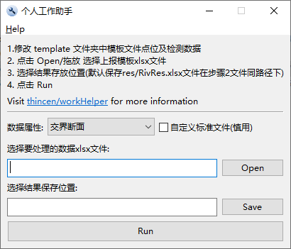

# WorkHelper

基于golang实现的**个人**工作助手, 快速处理检测点位等级评价和超标统计.支持乡镇集中式饮用水(地表水型/地下水型)、河流断面的数据分析统计.

  - [评价标准](#评价标准)
  - [数据模板](#数据模板)
    - [饮用水](#饮用水)
    - [交界断面](#交界断面)
  - [数据处理](#数据处理)
    - [支持的指标](#支持的指标)
    - [注意事项](#注意事项)
    - [结果保存](#结果保存)
  - [Windows Gui](#windows-gui)
  - [ToDo](#todo)
  - [已知问题](#已知问题)

## 评价标准

+ 地表水质量标准(GBT3838-2002)
+ 地下水质量标准(GBT14848-2017)

## 数据模板

未检出时填写 `检出限+L`

### 饮用水

+ 地表水型: `template/report-tpl/sur.xlsx`
+ 地下水型: `template/report-tpl/wel.xlsx`

### 交界断面

`template/report-tpl/riv.xlsx`

## 数据处理

遍历上报模板,对单点位检测数据评价,取最高等级为点位等级并记录超标信息.  

### 支持的指标

- 地表水

    地表水环境质量标准(GB3838-2002)表1的基本项目

  - 综合评价: 除水温、总氮、粪大肠菌群外所有指标均参与评价
  - 参考指标单独评价: 河流型水源地仅评价粪大肠菌群;湖库性水源地评价总氮和粪大肠菌群

- 地下水
  
    地下水质量标准(GB/T 14848-2017)表1中感官性状及一般化学指标、微生物指标、毒理学指标、放射性指标共39项

### 注意事项

`pH、嗅和味/肉眼可见物(地下水)` 特殊指标 **不计算超倍数**

地表水质量标准(GBT3838-2002)-表2补充项目 **不评价超标等级**  

(河流型水源地)粪大肠菌群、(湖库性水源地)总氮和粪大肠菌群**不参与点位等级评价**

交界断面均值计算:

- 上下游单站未检出，均值为`(未检出一方检出限/2+检出方的检测值)/2`；
- 上下游均未检出，均值为下游监测站的检出限

### 结果保存

默认为选定上报表格所在路径下:

- 饮用水(地表水型、地下水型）`res.xlsx`

    保存点位、取水量、评价等级、超标指标、数据逻辑和录入错误等信息

- 交界断面 `RivRes.xlsx`

    保存检测数据、评价等级、超标指标、数据逻辑和录入错误等信息

## Windows Gui

工作电脑多为windows,所以加入图形化界面方便使用。[Release](https://github.com/thincen/workHelper/releases)压缩包内包含模板和可执行二进制文件.

- [ ] 自定义标准文件选项: 一般情况完全没必要使用. **选中**时加载外部标准文件处理数据,更多信息在 [自定义外部标准](./core/README.md).

## ToDo

- [ ] web app dev
- [ ] 交界断面数据保存为盖章的pdf文件

## 已知问题

1. 交界断面数据处理时闪退,无任何处理结果
  
   模板riv.xlsx比实际工作中使用的上报模板多出最后“备注”列,保存结果时使用[tealeg/xlsx](github.com/tealeg/xlsx)包不作任何防错处理直接写死赋值最后一列为备注信息.
  
   检查 **riv.xlsx模板** 文件是否有备注列, 使用下载的模板处理数据
2. 检查更新失败
  
   网络环境的问题, 不懂的话简单认为是github有问题吧
  